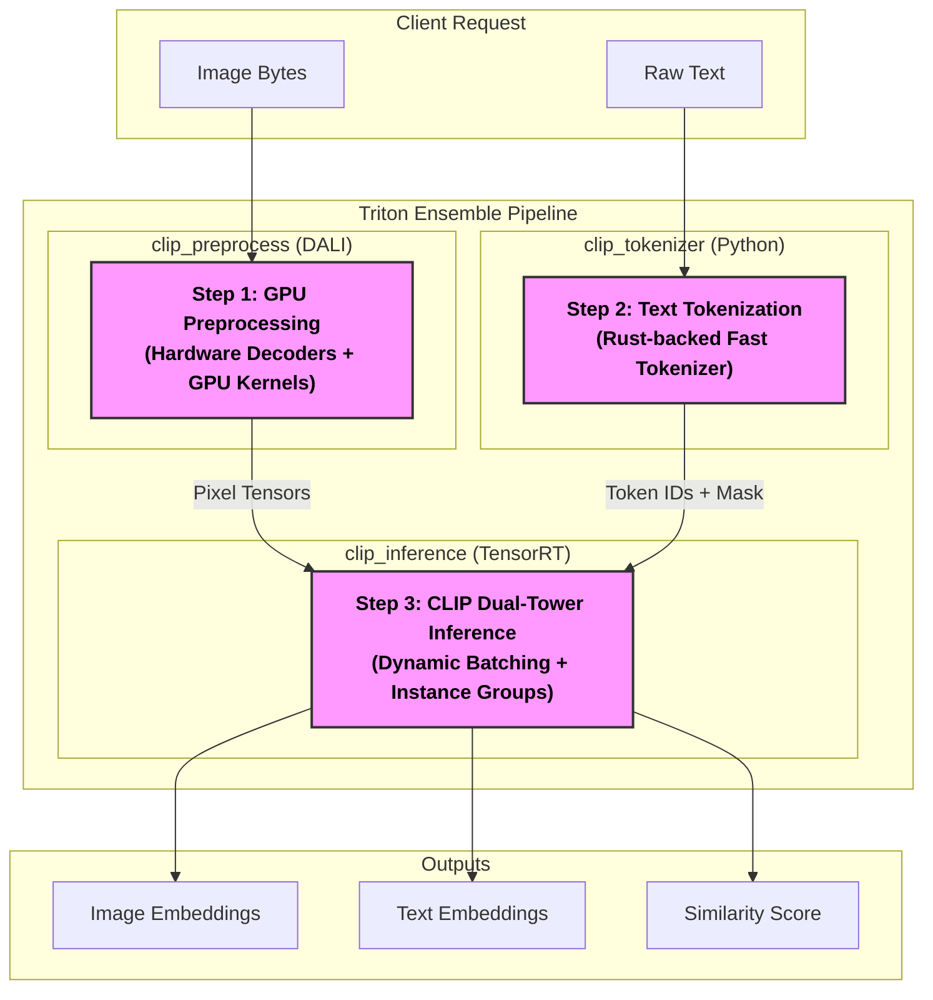

# Serving OpenAI CLIP at Scale: High-Performance DALI Preprocessing & Triton Ensemble

In the world of computer vision and natural language processing, OpenAI's **CLIP (Contrastive Language-Image Pre-Training)** is a cornerstone model. However, moving it from a research notebook to a high-throughput production environment presents challenges: heavy preprocessing, large dual-tower architecture, and multi-step inference pipelines.

In this guide, we'll demonstrate how to transform CLIP into a production-ready service using **NVIDIA Triton Inference Server** and **NVIDIA DALI**. We'll cover everything from model export to GPU-accelerated preprocessing and ensemble orchestration.

---

## 1. The Architecture: Triton Ensemble

The key to a clean, scalable deployment is the **Triton Ensemble**. Instead of managing separate microservices for tokenization, image processing, and inference, we stitch them together into a single, unified pipeline.

### The Pipeline Visualization

Below is the conceptual flow of our CLIP inference service. The highlighted blocks represent components that are horizontally or vertically scalable within the Triton environment.



> [!TIP]
> **Scaling Highlights**:
>
> - **DALI (Purple)**: Scalable via multiple GPU worker threads and NVDEC hardware units.
> - **Tokenizer (Purple)**: Scalable by increasing the number of concurrent model instances in the Triton config.
> - **Inference (Purple)**: Scalable via **Dynamic Batching** (combining requests) and **Model Instance Groups** (parallel execution).

### Model Repository Structure

Triton organizes models into a specific directory structure. Below is the layout of our CLIP `model_repository`, where each folder contains the model's configuration (`config.pbtxt`) and its executable versioning logic.

```text
model_repository/
├── clip_ensemble/
│   └── config.pbtxt
├── clip_inference/
│   ├── 1/
│   │   └── model.plan (TensorRT Engine)
│   └── config.pbtxt
├── clip_preprocess/
│   ├── 1/
│   │   └── model.py
│   └── config.pbtxt
└── clip_tokenizer/
    ├── 1/
    │   └── model.py
    └── config.pbtxt
```

As seen in the [clip_ensemble/config.pbtxt](https://github.com/kd303/LLM-LongContext-infer/blob/main/llm-inference/open-clip/pipeline/model_repository/clip_ensemble/config.pbtxt):

```pbtxt
# Orchestrating the pipeline
ensemble_scheduling {
  step [
    {
      model_name: "clip_preprocess"
      input_map { key: "IMAGE_INPUT", value: "IMAGE_BYTES" }
      output_map { key: "PIXEL_VALUES", value: "preprocessed_pixels" }
    },
    ...
    {
      model_name: "clip_inference"
      input_map { key: "pixel_values", value: "preprocessed_pixels" }
      ...
      output_map { key: "image_embeds", value: "IMAGE_EMBEDS" }
    }
  ]
}
```

[View full Ensemble Config on GitHub](https://github.com/kd303/LLM-LongContext-infer/blob/main/llm-inference/open-clip/pipeline/model_repository/clip_ensemble/config.pbtxt)

---

## 2. Model Export: PyTorch to TensorRT

To run CLIP at peak efficiency, we move from PyTorch to **TensorRT**. The process starts with an ONNX export, where we pay close attention to dynamic shapes to support variable batch sizes.

```python
# CLIPModel LOAD REPORT from: openai/clip-vit-base-patch32
# This ensures standard base weights are used before transformation.

# Exporting with modern dynamic_axes
torch.onnx.export(
    model,
    dummy_input,
    "openai_clip.onnx",
    opset_version=17,
    input_names=['input_ids', 'pixel_values', 'attention_mask'],
    output_names=['logits_per_image', 'logits_per_text', 'text_embeds', 'image_embeds'],
    dynamic_axes={
        'input_ids': {0: 'batch_size'},
        'pixel_values': {0: 'batch_size'},
        'attention_mask': {0: 'batch_size'},
    }
)
```

[Reference Notebook: Model Export Section](https://github.com/kd303/LLM-LongContext-infer/blob/main/llm-inference/open-clip/OpenAIClip_TritonDALI.ipynb)

> [!NOTE]
> **Notebook Insight**: `dynamic_axes` is not recommended when `dynamo=True`. Modern exporters prefer `dynamic_shapes` to avoid constraints violations.

Once exported, we use **`trtexec`** to compile a high-performance engine optimized for FP16 and target hardware like the NVIDIA A100.

```bash
trtexec --onnx=/data/models/openai_clip.onnx \
        --saveEngine=/data/models/model.plan \
        --fp16 \
        --minShapes=pixel_values:1x3x224x224,input_ids:1x77 \
        --optShapes=pixel_values:32x3x224x224,input_ids:32x77 \
        --maxShapes=pixel_values:64x3x224x224,input_ids:64x77 \
        --memPoolSize=workspace:4096MiB
```

---

## 3. High Performance Components

### 3.1 Python Backend Tokenizer

Text tokenization in CLIP (BPE-based) is a CPU-intensive task. We implement this using Triton's **Python Backend** with the Hugging Face `CLIPTokenizerFast`.

```python
class TritonPythonModel:
    def initialize(self, args):
        self.tokenizer = CLIPTokenizerFast.from_pretrained(
            "openai/clip-vit-base-patch32",
            use_fast=True
        )

    def execute(self, requests):
        # ... tokenization logic ...
        tokens = self.tokenizer(raw_texts, padding='max_length', max_length=77, truncation=True)
        return responses
```

[View Tokenizer source on GitHub](https://github.com/kd303/LLM-LongContext-infer/blob/main/llm-inference/open-clip/pipeline/model_repository/clip_tokenizer/1/model.py)

### 3.2 DALI for GPU Preprocessing

Standard image preprocessing is often a CPU bottleneck. **NVIDIA DALI** offloads image decoding (using NVDEC hardware on A100) and normalization directly to the GPU.

One of the standout features of this pipeline is handling raw image bytes:

> **"We send the raw bytes because our DALI pipeline starts with fn.decoders.image"**

```python
@pipeline_def(batch_size=32, num_threads=4, device_id=0)
def clip_preprocessing_pipeline(device="gpu"):
    jpegs = fn.external_source(device="cpu", name="IMAGE_INPUT")

    # Leverages A100 hardware decoders
    images = fn.experimental.decoders.image(jpegs, device="mixed", output_type=types.RGB)

    # Normalizing directly to CLIP distribution
    pixel_values = fn.crop_mirror_normalize(
        images, crop=(224, 224),
        dtype=types.FLOAT,
        output_layout="CHW",
        mean=[0.48144531 * 255, 0.4578275 * 255, 0.40821073 * 255],
        std=[0.26862954 * 255, 0.26130258 * 255, 0.27577711 * 255]
    )
    return pixel_values
```

[View DALI preprocessing source on GitHub](https://github.com/kd303/LLM-LongContext-infer/blob/main/llm-inference/open-clip/pipeline/model_repository/clip_preprocess/1/model.py)

---

## 4. Performance Benchmarks

By enabling **Dynamic Batching** and concurrent model instances, we can fully saturate the A100 GPU.

```text
[I] === Performance summary ===
[I] Throughput: 438.122 qps ***
[I] Latency: min = 3.79248 ms, max = 4.41853 ms, mean = 3.86752 ms
[I] GPU Compute Time: mean = 2.27573 ms
```

These numbers represent a massive leap over standard PyTorch serving. We achieve sub-5ms latency while processing over 400 queries per second.

---

## Conclusion

By combining **TensorRT** for inference, **DALI** for preprocessing, and **Triton Ensemble** for orchestration, we transform CLIP from a complex multi-stage model into a high-throughput, low-latency inference service ready for the most demanding production workloads.
